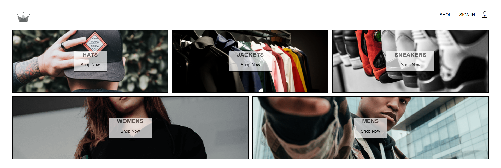

# CRWN Clothing

## Description
The project stems from a course specifying in ReactJS using technologies such as Firebase, Styled Components, Stripe, Redux, and more. The project is set to simulate an e-commerce store front with Google sign in incorporation and Stripe for checkout.

## Table Of Contents

- [CRWN Clothing](#crwn-clothing)
  - [Description](#description)
  - [Table Of Contents](#table-of-contents)
  - [Installation](#installation)
  - [Usage](#usage)
  - [Questions](#questions)

## Installation 

To install necessary dependencies, run the following command:

```
npm i
```

## Usage



The deployed application on Netlify can be found [here](https://main--stupendous-chebakia-41bda3.netlify.app/).

## Questions
If you have any questions about the repo, open an issue or contact me directly at travishackbarth@gmail.com. You can find more of my work at TravisH-bot (https://github.com/TravisH-bot).

